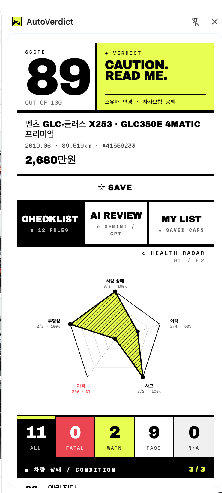
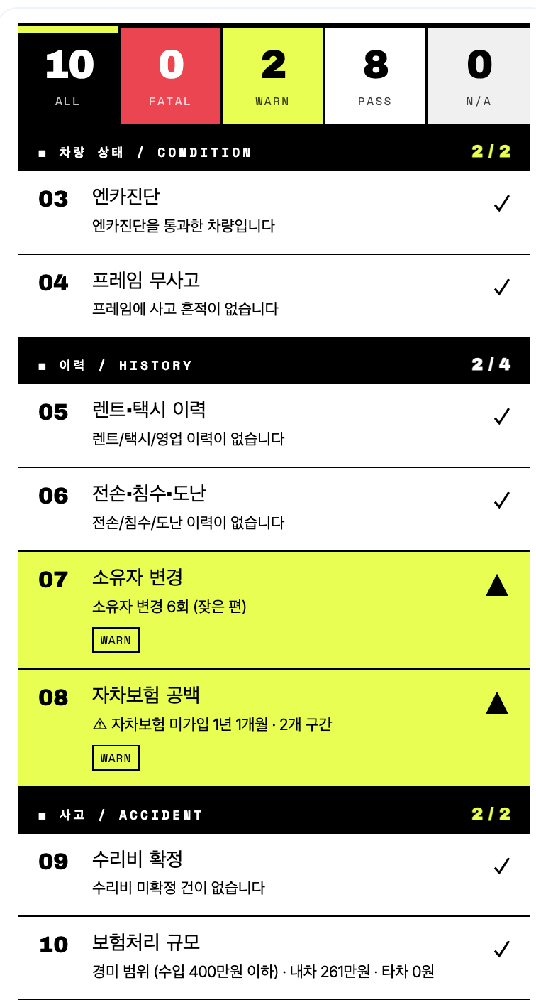
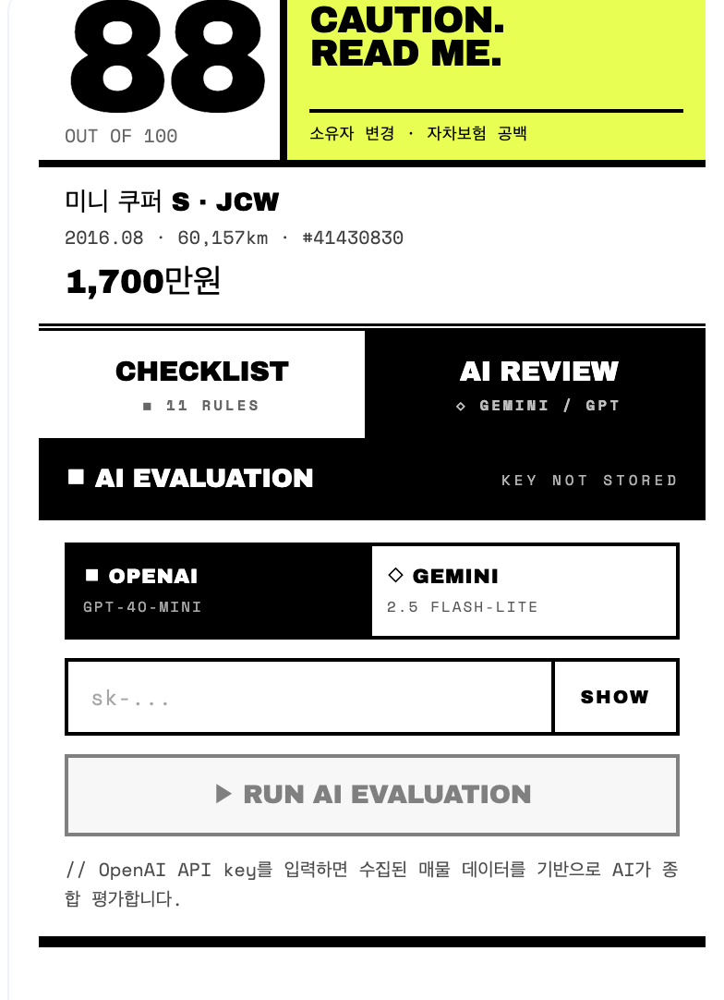

# AutoVerdict (오토버딕트)

> **엔카 매물, 살 만한 차인지 한눈에.**
_> 11가지 규칙으로 사고·이력·가격을 자동 채점하는 Chrome 사이드패널 확장.

---

## 이게 뭐야?

중고차 매물을 볼 때마다 반복하는 일이 있습니다.

- 보험이력 열어보고
- 성능점검 기록 확인하고
- 프레임 사고 여부 찾고
- 렌트·택시 이력 체크하고_
- 전손·침수 이력 뒤지고
- 시세 대비 가격이 적정한지 따지고…

**AutoVerdict** 는 이 과정을 전부 자동화합니다. 엔카 매물 페이지를 열고 사이드패널을 띄우면, 매물이 "살 만한지 / 조심해야 하는지 / 절대 사면 안 되는지" 를 **0~100 점수 + VERDICT** 로 즉시 판정합니다.

## 스크린샷

<p align="center">
  
  
  
</p>

## 핵심 기능

### 1. 11개 규칙 자동 채점

| ID  | 항목             | 성격      |
| --- | ---------------- | --------- |
| R01 | 보험이력 공개    | 투명성    |
| R02 | 성능점검 공개    | 투명성    |
| R03 | 엔카진단 통과    | 보너스    |
| R04 | 프레임 무사고    | **킬러**  |
| R05 | 렌트/택시 이력   | **킬러**  |
| R06 | 전손/침수/도난   | **킬러**  |
| R07 | 소유자 변경      | 이력      |
| R08 | 자차보험 공백    | 이력      |
| R09 | 수리비 미확정    | 사고      |
| R10 | 보험처리 규모    | 사고      |
| R11 | 가격 적정성      | 가격      |

**킬러 룰**(프레임 손상 · 렌트·택시 이력 · 전손/침수/도난) 이 하나라도 걸리면 `NEVER — DO NOT BUY.` 판정. 개별 룰은 "7일간 무시" 로 덮을 수 있습니다.

### 2. Brutalist Scoreboard UI

읽는 리스트가 아니라 **한눈에 보는 스코어보드** 입니다.

- 거대한 점수판 (Archivo Black 86px) + 형광 옐로우 VERDICT 박스
- 5축 HEALTH RADAR — 차량상태 · 이력 · 사고 · 가격 · 투명성 카테고리별 건강 상태
- ALL / FATAL / WARN / PASS / N/A 필터 탭 (스탯 겸용)
- 위험 룰은 적색 배경으로 리스트 안에서 즉시 돌출
- 두꺼운 4px 검정 경계, 정보 중복 없음, `prefers-reduced-motion` 존중

### 3. AI 리뷰 (선택)

Gemini / GPT 기반 AI 평가 패널을 별도 탭으로 제공. 규칙 엔진이 판정 못하는 맥락 정보(모델 특성 · 개별 옵션의 가치 등)를 보조합니다.

### 4. 로컬 캐시 (Dexie / IndexedDB)

한 번 수집한 매물 데이터는 로컬에 저장. 재방문 시 즉시 판정, 필요할 때만 재평가.

## 데이터 파이프라인

```
엔카 매물 페이지
      │
      ▼
[Content Script]  DOM + preloaded state + 이력 페이지 수집
      │
      ▼
[Background SW]   Layer A — 사이트별 원본(raw) 파싱
      │
      ▼
[Core Bridge]     Layer B — 사이트 불문 ChecklistFacts 로 정규화
      │
      ▼
[Rules Engine]    11개 Pure 함수 → RuleReport {verdict, score, results}
      │
      ▼
[Sidepanel]       Brutalist Scoreboard 렌더
```

- **Pure 규칙 엔진** — `ChecklistFacts` 만 입력받는 순수 함수. 테스트하기 쉽고, 새 사이트(kcar 등) 지원 시 브리지만 추가하면 됨.
- **FieldStatus 타입** — `{kind: 'value' | 'loading' | 'parse_failed' | 'timeout' | ...}` 로 데이터 부재를 1급 시민으로 취급. "수집 실패" 와 "값이 false" 를 혼동하지 않음.

## 기술 스택

- **Chrome Extension (Manifest V3)** — sidepanel API, service worker background
- **React 18** + TypeScript 5.6 — 사이드패널 UI
- **Vite** + `@crxjs/vite-plugin` — 번들
- **Dexie 4** — IndexedDB 캐시
- **Zod** — 런타임 스키마 검증
- **Vitest** — 단위/통합 테스트

## 프로젝트 구조

```
src/
├── sidepanel/         React 사이드패널 UI (Brutalist Scoreboard)
│   ├── components/    Hero, HealthRadar, RuleCard, FilterTabs ...
│   ├── hooks/         useCarData, useCountUp
│   └── theme.ts       COLORS, FONTS, globalCss
├── background/        Service worker, 메시지 라우팅, 수집 트리거
├── content/           엔카 페이지 주입 스크립트
└── core/              순수 로직 (사이트 불문)
    ├── rules/         11개 규칙 + evaluate()
    ├── bridge/        encar → ChecklistFacts 정규화
    ├── types/         ChecklistFacts, RuleTypes, FieldStatus
    ├── storage/       Dexie 캐시
    ├── messaging/     타입 안전한 protocol
    └── llm/           AI 평가 클라이언트
```

## 개발

```bash
npm install
npm run dev        # Vite 개발 서버
npm run build      # tsc --noEmit + vite build
npm run typecheck  # 타입만 검사
npm test           # vitest 단위/통합
```

확장 로드:

1. `npm run build` → `dist/` 생성
2. `chrome://extensions` → 개발자 모드 켜기 → "압축해제된 확장 프로그램 로드" → `dist/` 선택
3. 엔카 매물 페이지에서 사이드패널 아이콘 클릭

## 설계 원칙

- **파일당 200 LOC 이하** (`src/sidepanel/**` 엄수)
- **Inline style 금지** — 컴포넌트별 CSS 문자열 + className
- **CSS-in-JS 라이브러리 금지** — 번들 무게
- **규칙 엔진은 순수** — `chrome.*`, `fetch`, `window` 의존성 없음
- **데이터 부재는 1급 시민** — `FieldStatus` 로 loading / parse_failed / timeout 구분

## 면책

이 도구는 **구매 의사결정 보조** 용입니다. 최종 판단은 실차 확인 · 정비소 점검 · 계약서 검토를 거쳐야 합니다. 엔카가 제공하지 않는 데이터(예: 실제 도장면 상태 · 엔진 컨디션)는 판정에 포함되지 않습니다.